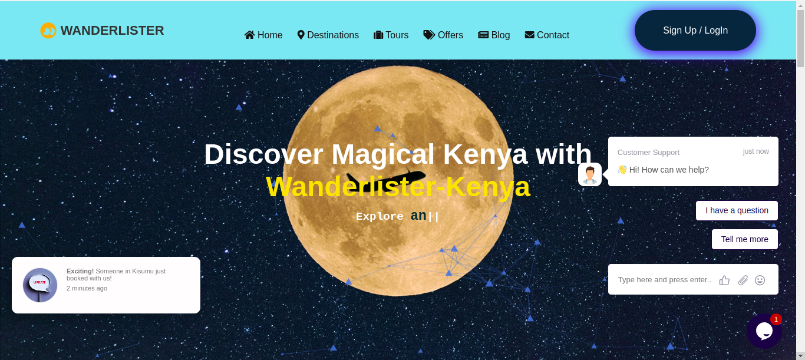

.
# Wanderlister

Wanderlister is a sophisticated web application designed to assist users in creating and managing their travel bucket lists. With features such as dedicated destination pages, real-time weather forecasts, and seamless booking options, Wanderlister aims to enhance the travel planning experience.

## Features

- **Bucket List Management**: Users can efficiently add, edit, and remove destinations from their travel lists.
- **Destination Pages**: Each destination is presented with comprehensive information and high-quality images.
- **Weather Forecast Integration**: Access real-time weather updates for selected destinations.
- **Booking Functionality**: Utilize the "Book Now" button to explore and secure travel options directly through the application.

## Technology Stack

- **HTML**: Utilized for structuring the content of the application.
- **CSS**: Employed for styling and layout to ensure a visually appealing user interface.
- **JavaScript**: Implemented for interactivity and dynamic content management.
- **Font Awesome**: for icons
-**JSON Server** for local data on destinations
-**AOS (Animate On Scroll)** for animation effects

## Installation

1. Clone the repository:
   ```bash
   git clone https://github.com/edogola4/wanderlister.git
   ```

2. Navigate to the project directory:
   ```bash
   cd wanderlister
   ```

3. Open `index.html` in a web browser to access the application.

## Usage

- Begin by adding destinations to your bucket list.
- Click on a destination to view detailed information and the corresponding weather forecast.
- Utilize the "Book Now" button to discover and secure travel arrangements.

## Future Improvements
User Reviews: Adding a section for users to leave reviews on tours and destinations.
User Accounts: Implementing login and user profiles for personalized recommendations.

## Contributing

Contributions to the project are highly encouraged. If you have suggestions for enhancements or wish to report issues, please submit a pull request or open an issue on the repository.

## License

This project does not currently have a specified license. Users are free to utilize and modify the application as needed.

## Acknowledgments

I extend my gratitude myself as a contributor and users for their valuable feedback and support.
